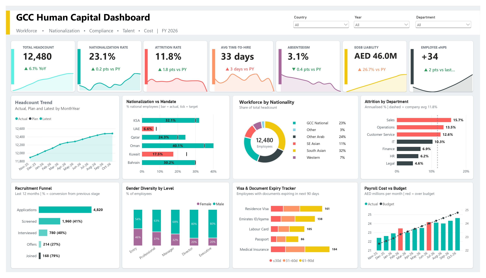

# GCC Human Capital Dashboard (Power BI)

An HR analytics dashboard for a GCC (Gulf) workforce, built in Power BI Desktop. It tracks headcount, nationalization (Saudization, Emiratisation, etc.), attrition, hiring, compliance and cost in one page.



> **Note:** All data is synthetic and generated for learning/portfolio purposes. Currency is AED. Data as of 05-Oct-2026.

## KPIs
| KPI | What it shows |
|---|---|
| Total Headcount | Active employees, with YoY change |
| Nationalization Rate | % national employees vs country mandates |
| Attrition Rate | Leavers in last 12 months / headcount |
| Avg Time-to-Hire | Days from application to joining |
| Absenteeism | Absent days / scheduled days |
| WPS Compliance | Employees paid through the Wage Protection System |
| EOSB Liability | Accrued end-of-service benefits (AED M) |
| Employee eNPS | Latest survey score |

## Visuals
- Headcount trend vs plan
- Nationalization vs mandate (KSA, UAE, Qatar, Oman, Kuwait, Bahrain)
- Workforce by nationality
- Attrition by department
- Recruitment funnel with stage conversion
- Gender diversity by job level
- Visa and document expiry tracker (30/60/90 days)
- Payroll cost vs budget

## Data model
Star schema with these tables:
- **Facts:** Employees, Recruitment, Payroll, Attendance, eNPS, HeadcountPlan
- **Dimensions:** Dim_Date, Dim_Country, Dim_Department, Dim_JobLevel, Dim_Stage
- `Doc_Expiry` is built in Power Query by unpivoting the document expiry columns of Employees.
- `Dim_Date` connects to Employees through two inactive relationships (HireDate, TerminationDate) used with `USERELATIONSHIP`.

## Selected DAX
```DAX
Headcount =
VAR d = MAX(Dim_Date[Date])
RETURN COUNTROWS(FILTER(Employees,
  Employees[HireDate] <= d &&
  (ISBLANK(Employees[TerminationDate]) || Employees[TerminationDate] > d)))

Leavers = CALCULATE(COUNTROWS(Employees),
  USERELATIONSHIP(Employees[TerminationDate], Dim_Date[Date]),
  NOT ISBLANK(Employees[TerminationDate]))

Attrition % = DIVIDE([Leavers L12M], [Headcount])
Nationalization % = DIVIDE([National HC], [Headcount])
```

## Repository structure
```
├── GCC_HR_Dashboard.pbix
├── data/
│   └── GCC_HR_Dataset.xlsx
├── theme/
│   └── GCC_HR_Theme.json
├── images/
│   └── dashboard.png
└── README.md
```

## How to open
1. Download the repo and open `GCC_HR_Dashboard.pbix` in Power BI Desktop.
2. If Power BI cannot find the data, go to **Home → Transform data → Data source settings → Change Source** and point it to `data/GCC_HR_Dataset.xlsx`.
3. Click **Refresh**.

## Tools
Power BI Desktop, Power Query, DAX, Excel.
